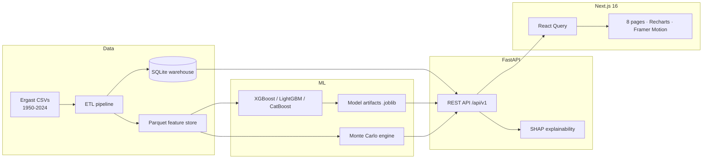

<div align="center">

# 🏁 F1 Oracle AI

### A premium Formula 1 machine-learning platform

Predict race outcomes, run thousands of Monte Carlo simulations, and explore 75 seasons of Grand Prix history — wrapped in a clean, premium dashboard.

[](https://nextjs.org)
[](https://react.dev)
[](https://www.typescriptlang.org)
[](https://fastapi.tiangolo.com)
[](https://www.python.org)
[](#testing)

</div>

---

## Overview

**F1 Oracle AI** combines a gradient-boosting ML ensemble, a Monte Carlo race-simulation engine, and a restrained, premium Next.js dashboard (think Linear × Stripe × Bloomberg Terminal) over the complete Ergast Formula 1 dataset (**1950–2024**).

| Dataset | ML models | Validated accuracy |
| --- | --- | --- |
| 1,125 Grands Prix · 861 drivers · 212 constructors · 77 circuits · 26,759 results | XGBoost · LightGBM · CatBoost ensemble | Winner **0.987** · DNF **0.957** · Podium **0.942** · Points **0.942** (ROC AUC) |

## Features

- **🎯 AI Prediction Center** — winner, podium, points and DNF probabilities for any Grand Prix, with **SHAP** explanations of what drives each call and a per-team performance breakdown.
- **🎲 Race Simulator (flagship)** — thousands of Monte Carlo iterations on a real race grid, rendered as an animated outcome leaderboard with confidence intervals.
- **👤 Driver Analytics** — searchable across all 861 drivers: career stats, Oracle Rating, GOAT rank, archetype, season trends, and head-to-head comparison radars.
- **🏎️ Constructor Analytics** — titles, reliability, pit-stop efficiency and championship evolution across the decades.
- **📍 Circuit Intelligence** — overtaking difficulty, attrition, chaos index, pit trends, recent winners and AI track profiles.
- **📈 Historical Analytics** — season standings, championship battles and the greatest rivalries in F1 history.
- **🔬 Research Lab** — unsupervised driver clustering with PCA / t-SNE projections, SHAP feature attribution, and a career-metric correlation heatmap.

## Architecture



A deeper write-up lives in [`docs/ARCHITECTURE.md`](docs/ARCHITECTURE.md).

## Tech stack

| Layer | Technologies |
| --- | --- |
| **Frontend** | Next.js 16 · React 19 · TypeScript · Tailwind CSS v4 · Radix UI · Framer Motion · Recharts · TanStack Query · Zustand |
| **Backend** | FastAPI · SQLAlchemy · Pydantic · Uvicorn |
| **ML** | scikit-learn · XGBoost · LightGBM · CatBoost · SHAP · MLflow · Optuna |
| **Data** | SQLite warehouse · Parquet feature store (Neon Postgres-ready) |

## Quick start

> Prerequisites: **Python 3.11+**, **Node 18+**, npm.

```bash
# 1. Backend — install deps and build the warehouse, features and models
pip install -r requirements.txt
python scripts/setup_all.py          # ETL -> feature store -> trains models

# 2. Run the API (http://localhost:8000, docs at /docs)
python -m uvicorn backend.main:app --reload --port 8000

# 3. Frontend (in a second terminal)
cd frontend
npm install
cp .env.example .env.local           # points NEXT_PUBLIC_API_URL at the API
npm run dev                           # http://localhost:3000
```

Open **http://localhost:3000**. See [`docs/USER_MANUAL.md`](docs/USER_MANUAL.md) for a full walkthrough and [`docs/DEPLOYMENT.md`](docs/DEPLOYMENT.md) to ship it.

## Project structure

```
f1/
├── backend/            FastAPI app — API routes, ORM models, data & ML services
├── ml/                 ETL pipeline, model training, Monte Carlo, artifacts
├── data/               raw CSVs, Parquet feature store, SQLite warehouse (generated)
├── configs/            central settings
├── scripts/            setup_all.py, run_pipeline.py, verify_api.py
├── tests/              pytest suite (26 tests)
├── frontend/           Next.js 16 app (App Router)
│   └── src/
│       ├── app/        8 route pages + root layout
│       ├── components/ ui/ (shadcn-style), layout/, charts/, shared/
│       ├── hooks/      typed React Query hooks
│       ├── lib/        API client, types, formatters
│       └── store/      Zustand UI store
└── docs/               architecture, deployment, user manual, portfolio
```

## Testing

```bash
python -m pytest tests/ -v     # 26 passing
cd frontend && npm run lint    # ESLint — clean
cd frontend && npm run build   # production build — clean
```

## Documentation

- [Architecture](docs/ARCHITECTURE.md) — system design, data flow, ML pipeline
- [Deployment](docs/DEPLOYMENT.md) — Vercel + Railway/Render + Neon
- [User manual](docs/USER_MANUAL.md) — features, retraining, adding data, maintenance
- [Portfolio pack](docs/PORTFOLIO.md) — pitch, resume bullets, talking points

## License

MIT © F1 Oracle AI. Formula 1 data courtesy of the [Ergast](http://ergast.com/mrd/) Developer API. This is an independent project and is not affiliated with Formula 1.
